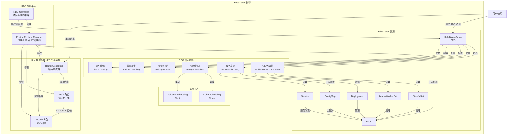
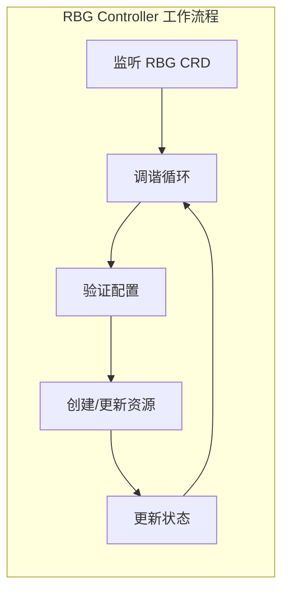
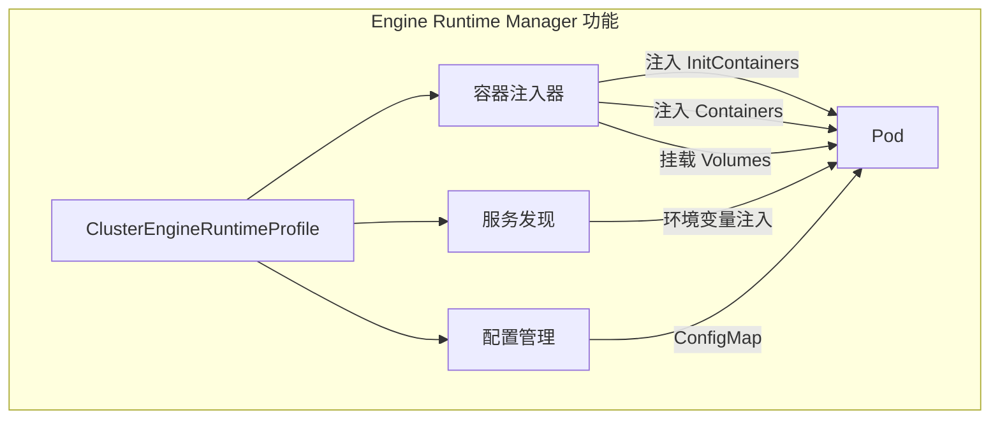
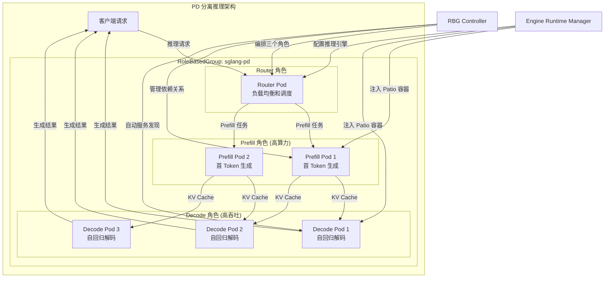
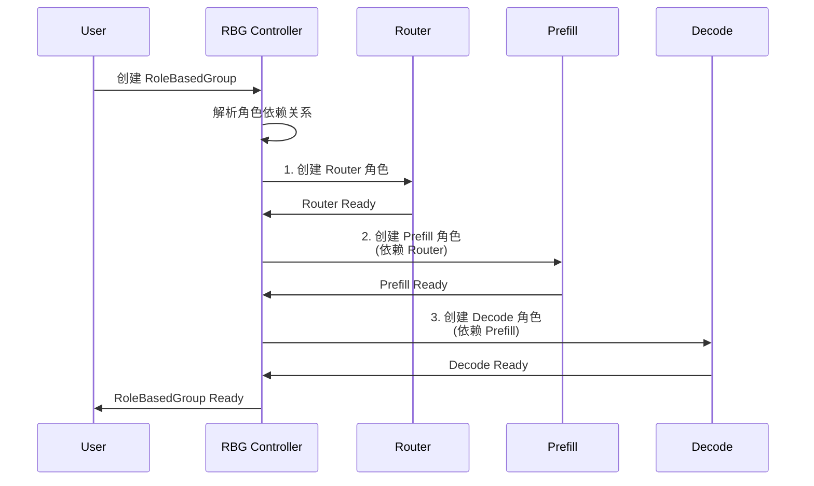
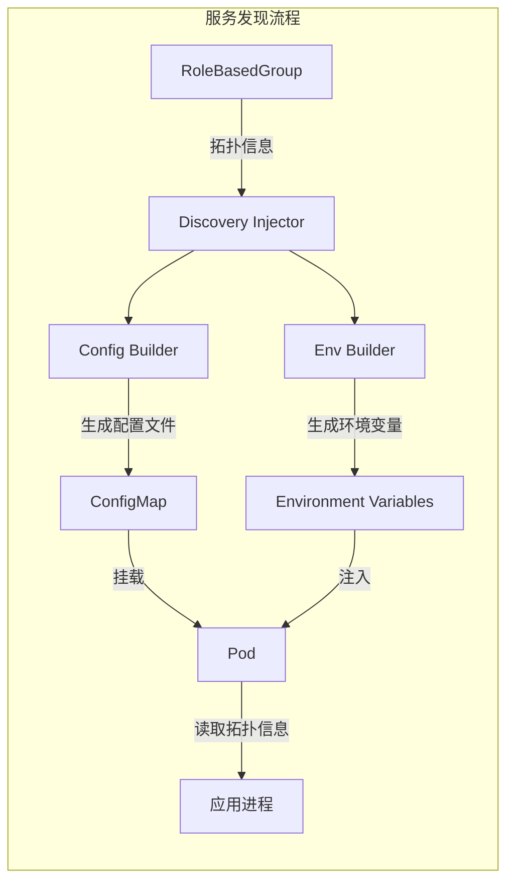
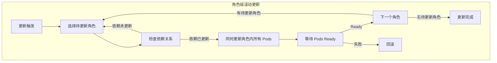

# RBG 架构图

本文档展示了 RoleBasedGroup (RBG) 项目的整体架构设计和核心组件。

## 整体架构

## 核心组件详解

### 1. RBG Controller (核心编排控制器)

RBG Controller 是项目的核心组件，负责：

- **多角色编排**: 管理复杂拓扑中的多个角色（如 Prefill、Decode、Router 等）
- **依赖关系管理**: 处理角色之间的启动顺序依赖
- **生命周期管理**: 协调多个角色的创建、更新、删除
- **配置管理**: 统一管理分布式系统的配置
- **调度协同**: 与 Kubernetes 调度器插件集成，支持 Gang Scheduling
- **滚动更新**: 以角色为单位进行原子化升级
- **故障恢复**: 触发角色级别的故障恢复机制

### 2. Engine Runtime Manager (推理引擎运行时管理器)

Engine Runtime Manager 通过 `ClusterEngineRuntimeProfile` CRD 为大模型推理场景提供支持：

- **容器注入**: 向 Pod 中注入推理引擎相关的 sidecar 容器
- **模型切换**: 支持动态模型加载和切换
- **服务发现**: 在推理引擎组件之间提供服务发现机制
- **资源规划**: 为 PD 分离场景规划 Prefill 和 Decode 角色的资源配比
- **运行时配置**: 管理推理引擎的运行时参数和环境变量

## LLM 推理场景 - PD 分离架构

RBG 特别适用于大语言模型的 Prefill-Decode 分离部署场景：

### PD 分离的优势

1. **解耦 Prefill 和 Decode**: 分别优化两个阶段的资源配置和并行策略
2. **提高资源利用率**: Prefill 需要高算力，Decode 需要高吞吐，独立扩缩容
3. **降低干扰**: 避免 Prefill 和 Decode 的计算相互干扰
4. **灵活配比**: 根据业务特点调整 Prefill 和 Decode 的 Pod 数量比例

## 关键特性流程图

### 多角色启动顺序

### 服务发现机制

### 滚动更新策略

## 技术栈

- **Kubernetes**: 容器编排平台
- **Controller Runtime**: Kubernetes Controller 开发框架
- **StatefulSet/LeaderWorkerSet/Deployment**: 工作负载类型
- **Scheduler Plugins**: Gang Scheduling 支持
- **Custom Resource Definitions (CRDs)**: 
  - RoleBasedGroup
  - ClusterEngineRuntimeProfile
  - Instance
  - InstanceSet

## 适用场景

1. **LLM 推理服务**: Prefill-Decode 分离部署
2. **分布式数据库**: 多角色协同（如主从、分片）
3. **消息队列集群**: Broker、Controller、ZooKeeper 等角色
4. **微服务网格**: 需要严格启动顺序的服务组
5. **AI 训练框架**: Parameter Server、Worker 等角色

## 参考资料

- [RBG Quick Start](./quick_start.md)
- [Multi Roles Feature](./features/multiroles.md)
- [Gang Scheduling](./features/gang-scheduling.md)
- [Update Strategy](./features/update-strategy.md)
- [Failure Handling](./features/failure-handling.md)
